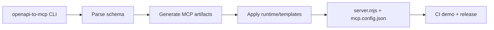

# openapi-to-mcp

**Generate secure-by-default MCP server scaffolds from OpenAPI, GraphQL, and JSON-RPC schemas.**


## What it does
`openapi-to-mcp` ingests OpenAPI/GraphQL/JSON-RPC schemas and generates ready-to-run MCP server scaffolds with safe runtime defaults for auth, rate limits, and structured logging. It is optimized for fast bootstrap in CI and local dev, including reproducible example generation and committed demo outputs.

## Who it’s for
- Platform engineers building MCP adapters quickly
- API teams exposing existing services as MCP tools
- AI infra teams standardizing secure server scaffolding
- OSS maintainers who need deterministic code generation in CI

## Features
- CLI generator (`init`, `build`, `--version`) with clear error messages
- OpenAPI JSON/YAML parsing to MCP tool stubs
- GraphQL Query/Mutation extraction to MCP tool stubs
- JSON-RPC method extraction to MCP tool stubs
- Generated server artifacts with safe env-based defaults (no hardcoded secrets)
- Reproducible demo output committed under `examples/output`
- Monorepo package split: generator/runtime/templates/cli
- CI workflows for lint/test/demo + release + docker build check

## Quickstart
```bash
git clone https://github.com/Exmanq/openapi-to-mcp.git
cd openapi-to-mcp
make setup
make doctor
make demo
```

## Installation
```bash
npm i -g openapi-to-mcp
openapi-to-mcp --version
```

Or local install from source:
```bash
npm i
npm run build
node dist/packages/cli/src/index.js --version
```

## Example output / screenshots
Real output produced by `make demo` and committed at `examples/output/demo-summary.json`:

```json
{
  "minimal": { "name": "petstore-mcp", "toolCount": 3 },
  "advanced": { "name": "rpc-mcp", "toolCount": 2 }
}
```

Generated files:
- `examples/output/generated-minimal/server.mjs`
- `examples/output/generated-advanced/server.mjs`
- `examples/output/demo-summary.json`

## How it works


The CLI reads schema input and schema type explicitly from flags to avoid ambiguous inference. Parsed operations are normalized into MCP tool descriptors and passed to template rendering. The renderer emits portable Node server stubs and config metadata with env-based auth/rate-limit/logging defaults. Optional runtime template output provides a minimal safe-defaults module. Demo flow runs the generator against both minimal and advanced schemas and writes deterministic outputs to `examples/output`. CI re-runs these checks on every push and PR. Deep architecture notes are in `docs/ARCHITECTURE.md`.

## Configuration
All flags, env vars, and config files are listed in `docs/CONFIG.md`.

## Troubleshooting
- **`npm` not found**: install Node.js 20+ and rerun `make setup`
- **`No operations found in schema`**: pass explicit `--type` and validate schema shape
- **Need stack trace**: set `OPENAPI_TO_MCP_VERBOSE=1`
- **Generated output differs**: rerun `make demo` and verify input examples are unchanged

## Contributing
See `CONTRIBUTING.md`.

## Security
Store tokens/keys only in environment variables; never commit credentials. Generated config includes env var names only and does not log token values. See `SECURITY.md`.

## License
MIT, see `LICENSE`.
