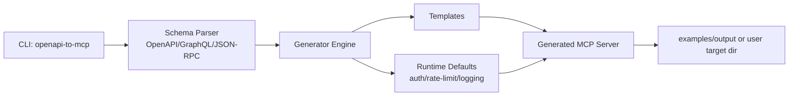

# Architecture

## Dataflow
1. CLI loads user input schema and explicit schema type.
2. Parser extracts operations/methods as MCP tool candidates.
3. Generator normalizes operations and applies naming safeguards.
4. Templates produce portable Node server stubs.
5. Runtime defaults include auth/rate-limit/logging env conventions.
6. Build output includes `server.mjs` and `mcp.config.json` for immediate run.
